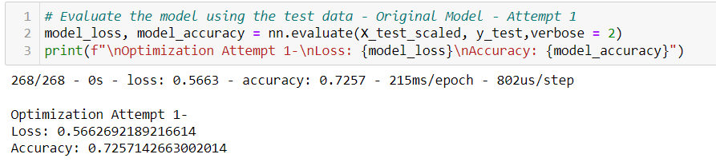

# Neural_Network_Charity_Analysis
 Module19 

# Overview
Deep-learning neural networks were utilized to evaluate the success of applicants that have been supported by donations collected for Alphabet Soup, a non-profir organization.

# Results

## Data Preprocessing
**What variable(s) are considered the target(s) for your model?**  
The IS_SUCCESSFUL column described if the money used effectively (0: no; yes:1). Since it is the binary column it was used as the target for the model.  

**What variable(s) are considered to be the features for your model?**  
The fetures for the model are the APPLICATION_TYPE, AFFILIATION, CLASSIFICATION, USE_CASE, ORGANIZATION, STATUS, INCOME_AMT, SPECIAL_CONSIDERATION, and ASK_AMT columns.  
**What variable(s) are neither targets nor features, and should be removed from the input data?**  
The identification columns are neither targets nor fetaures and cannot be used to make predictions therfore the EIN and NAME columns have been removed.  

## Compiling, Training, and Evaluating the Model
**How many neurons, layers, and activation functions did you select for your neural network model, and why?**  
A ReLU activation function (suitable for identifying nonlinear charecteristcs) was used for 2 hidden layers and a sigmoid activation function (suitable for binary classifyiers) was used for the output layer. Following the general rule that to avoid overfitting, the number of neurons used is to be 2 to 3 times the features, one hidden layer had 80 neurons and another had 30 neurons (total 110).  

**Were you able to achieve the target model performance?**  
The model achieved an accuracy of 72.4% therefore it did not achieve the target 75%.
  

**What steps did you take to try and increase model performance?**  
| Model          |Loss (%)| Accuracy (%) | Steps Taken |
| :---           | :---:  | :---: |          :--- |
| Original       | 56.9   | 72.5  |     |
| Attempt 1      | 56.6   | 72.6  | Increased the number of neurons to 120 for hidden layer 1 and 50 for hidden layer 2    |
| Attempt 2      | 58.4   | 72.4  | Increased the number of hidden layers to 4 (neurons: 80, 30, 120, 50)    |
| Attempt 3      | 55.6   | 72.4  | Increased the number of hidden layers to 4 (neurons: 80, 30, 120, 50) and activation model of input layers to tanh    |

### Atempt 1 Results
  

### Atempt 2 Results

### Atempt 3 Results
  

Overall, the steps taken in the three attempts above did not improve the accuracy of the model.  
 
# Summary
Overall, the models came close to the target accuracy o f75% but none achieved it. Since the data contains categorical variable and continous variables, a random forest classifier o rlogistic regression model may generate a more accurate model.
